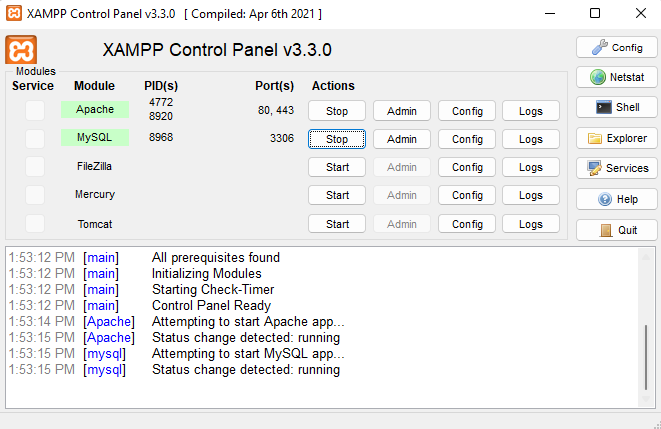

# Tugas Pemograman Web 2
## Profil
| #               | Biodata           |
| --------------- | ----------------- |
| **Nama**        | Basri Sangaji     |
| **NIM**         | 312110152         |
| **Kelas**       | TI.21.A.1         |
| **Mata Kuliah** | Pemrograman Web 2 |

## Langkah-langkah Praktikum
### Persiapan
Untuk memulai membuat aplikasi CRUD sederhana, yang perlu disiapkan adalah database server
menggunakan MySQL. Pastikan MySQL Server sudah dapat dijalankan melalui XAMPP.

### Menjalankan MySQL Server
Untuk menjalankan MySQL Server dari menu XAMPP Contol.

